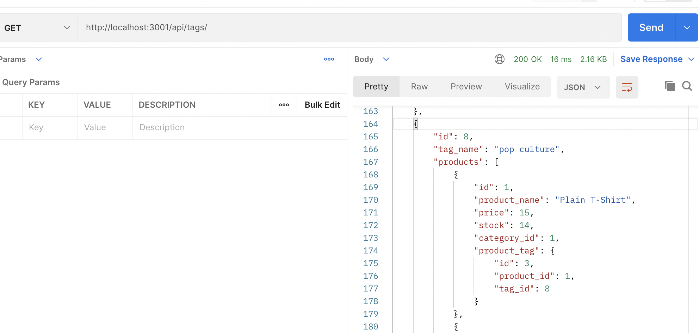

# E-Commerce Back End  
    
  ## Description  
  This project provides server, database, and routing functionality for an E-Commerce website.  
     
  ## Image Of Deployed Application
     
     
  ## [Link to Application deployed at Heroku](https://guarded-caverns-05916.herokuapp.com/)
    
  *[Link To Category Video](https://drive.google.com/file/d/13jiGYt5D7CkrR2qJIuO_Yi5shgHDzOxX/view)*  
  *[Link To Product Video](https://drive.google.com/file/d/1VCECNVCPCLVVSlMkGE5TFsRq5R981UUx/view)*  
  *[Link To Tag Video](https://drive.google.com/file/d/1EMPy4oxb9yeXS4dVECK9vhv5AU_pBKqI/view)*   
     
  ## Table of Contents   
  [Installation](##Installation)  
  [Usage](##Usage)  
  [License](##License)  
  [Contributiing](##Contributing)  
  [Tests](##Tests)  
  [Questions](##Questions)
    
  ## Installation  
  To utilize this project the dependencies will need to be installed after cloning onto your local machine. Simply run the comand `npm install` from your terminal window.  
  ## Usage  
  The stored data mahy be accessed by utilizing the api's provided. Through Postman or a similar service of your choice, you may view, update, or create data by utilizing get requests, post requests, and put requests. Requests made to `http://localhost:3001/api/catgories`, will return/manipulate category data. Requests mage to `http://localhost:3001/api/products`, will return/manipulate product data. And requests made to `http://localhost:3001/api/tags`, will return/manipulate tag data.
  ## License   
  This project is not licensed.    
  ## Contributing  
  There are no guidliines for contribution at this time.  
  ## Tests   
  There are no testing instructions at this time.  
  ## Questions  
  I can be reached at mcbrayer.ian@gmail.com for further information.  
  Please feel free to also check out my work at https://github.com/ihm57511
